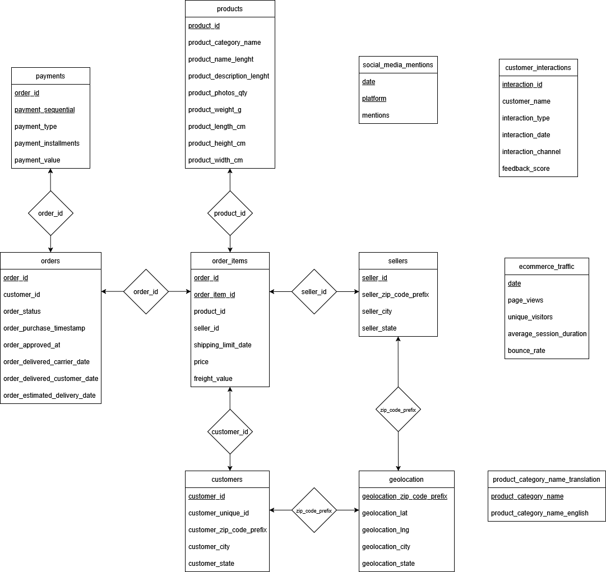

#  E-Commerce Analytics System with LLM-Augmented Intelligence (Work in Progress)

## Overview

This project presents a comprehensive e-commerce analytics system developed using **PostgreSQL**, based on the **Brazilian E-Commerce Public Dataset**. It is designed to enable scalable storage, efficient querying, and insightful reporting of customer, order, payment, and seller data. The system is currently being extended with **LLM-powered capabilities** to support intelligent text analysis and automated business reporting.

---

##  Dataset

This project uses the **Brazilian E-Commerce Public Dataset** from [Kaggle](https://www.kaggle.com/datasets/olistbr/brazilian-ecommerce), which is a rich and realistic dataset covering:

- Customer profiles and purchase history  
- Order items, product details, and categories  
- Sellers and geolocation data  
- Payment methods and transaction values  
- Customer interactions, feedback scores, and web/social traffic

This dataset provides a strong foundation for building SQL-based analytics and for exploring trends in customer behavior, delivery performance, and product sales.

 **Dataset Download**:  
[https://www.mediafire.com/folder/6h3yq2a50167g/Data](https://www.mediafire.com/folder/6h3yq2a50167g/Data)

---

## Phase 1: PostgreSQL-Based Analytics System

###  Technologies Used
- PostgreSQL
- SQL (DDL, DML, analytical queries)
- PL/pgSQL (stored procedures, triggers)
- Indexing and query optimization
- Dataset: Brazilian E-Commerce (Olist) from Kaggle

###  Core Features Implemented
- Structured schema with 11+ interconnected tables representing customers, orders, products, payments, geolocation, and more
- Data cleaning and loading using SQL scripts
- Complex queries for sales trends, delivery delays, seller rankings, and customer behavior
- Stored procedures for customer and order management workflows
- Triggers for error logging and data integrity
- Performance tuning using `EXPLAIN ANALYZE` and targeted indexing strategies

###  Deliverables
- `load_create.sql`: Defines all table schemas, constraints, and data load operations
- `sql project 2.sql`: Includes core SQL logic — CRUD operations, business analytics, functions, triggers, and indexes
- `Phase2report.pdf`: Detailed project documentation covering schema design, use cases, ER diagrams, query logic, and performance optimization

---

###  ER Diagram

Below is the Entity-Relationship diagram representing the full schema used in the analytics system:

---

## Phase 2: Integration of Large Language Models (In Progress)

We are extending the system by incorporating **LLMs (Large Language Models)** to extract insights from unstructured customer data and generate human-readable reports.

###  Planned Additions
- Python modules for:
  - Summarizing free-text customer feedback
  - Classifying issues (e.g., delivery problems, product quality, etc.)
  - Generating executive summaries of monthly performance metrics
- Fine-tuning an open-source 7B LLM (e.g., **Mistral** or **LLaMA 2**) using QLoRA on an RTX 4090 setup
- Real-time dashboard using **Gradio** or **Streamlit**
- Integration with **Power BI** or **Tableau** for visual summaries

###  Intended Use Cases
- NLP-driven summaries of SQL outputs for business stakeholders
- Automatic tagging and classification of customer issues
- Sentiment trend tracking based on interaction scores over time

---

##  Authors and Contributions

| Name                | Contributions                                                                 |
|---------------------|------------------------------------------------------------------------------|
| **Pratheek Tirunagari** | Schema design, stored procedures, analytics queries, indexing, documentation |
| **Ashruj Gautam**       | Trigger mechanisms, performance analysis, advanced SELECT queries, data maintenance logic |

---

##  Project Status

-  SQL infrastructure and analytics system completed  
-  LLM integration module under development (ETA: ~6–8 weeks)  
